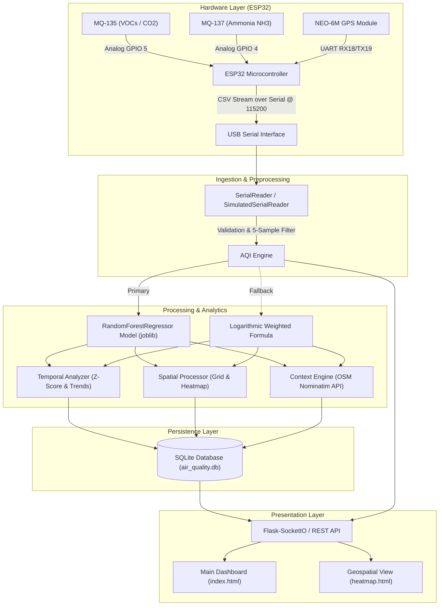

# AirIQ

AirIQ is a hyperlocal air quality monitoring and intelligence system that combines IoT hardware telemetry with machine learning predictions, spatial grid aggregation, and real-time web visualization. It ingests gas sensor data and GPS coordinates from an ESP32 microcontroller, calculates an Air Quality Index (AQI), detects environmental anomalies, and renders live geospatial heatmaps for localized monitoring.

## Overview

Traditional air quality monitoring systems rely on sparse, stationary government stations that fail to capture localized micro-climates, industrial spikes, or neighborhood-level pollution variations. AirIQ addresses this gap by providing a portable, low-cost sensor platform paired with an analytical backend. 

The system reads gas concentration levels ($\text{NH}_3$, VOCs/general air pollutants) and GPS positioning from an ESP32 microcontroller over serial communication. The backend processes raw telemetry through a pre-trained Random Forest ML model (with a continuous deterministic fallback engine), stores historical readings in SQLite, performs spatial grid aggregation (~100m resolution), detects temporal anomalies, queries nearby industrial context via OpenStreetMap, and streams live data to an interactive web dashboard over WebSockets.

```
┌─────────────────┐       USB Serial       ┌────────────────────────┐
│ ESP32 Node      │ ─────────────────────> │ Python Flask Backend   │
│ - MQ-135        │ (115200 Baud, CSV)    │ - Serial Reader        │
│ - MQ-137        │                        │ - ML / Hybrid Engine   │
│ - NEO-6M GPS    │                        │ - Temporal & Spatial   │
└─────────────────┘                        │ - SQLite Database      │
                                           └───────────┬────────────┘
                                                       │ WebSockets / REST
                                                       ▼
                                           ┌────────────────────────┐
                                           │ Web Dashboard          │
                                           │ - Leaflet Heatmaps     │
                                           │ - Live Telemetry & AQI │
                                           │ - Chart.js Trends      │
                                           └────────────────────────┘
```

## Key Features

* **Real-Time Telemetry Ingestion**: Continuous 2-second serial polling from ESP32 featuring 5-sample moving average noise smoothing, input validation, and automatic reconnection with exponential backoff.
* **Hybrid AQI Calculation Engine**:
  * **ML-Powered Engine**: Evaluates raw sensor signals through a trained `RandomForestRegressor` model mapped to pollutant features (`no2`, `co`, `pm10`, `pm25`).
  * **Deterministic Fallback**: Logarithmic gas-to-AQI weighted mapping formula ($0.7 \times \text{MQ-135} + 0.3 \times \text{MQ-137}$) with temporal and spatial modifiers.
* **Geospatial & Grid Aggregation**: Aggregates spatial data into $0.001^\circ$ (~100m) geographic grid cells, detects pollution hotspots, and renders Gaussian kernel heatmaps using Leaflet.js.
* **Temporal Intelligence & Anomaly Detection**: Tracks short-term (5-min) vs long-term (30-min) moving averages, identifies statistical spikes ($Z\text{-score} > 2.0$), and generates alerts for rapid pollution rises.
* **Context-Aware Proximity Analysis**: Queries OpenStreetMap (Nominatim API) within a 2km radius to detect nearby industrial facilities, caching results in SQLite (1-hour TTL) to reduce API load.
* **Interactive Single-Page Dashboard**: Built with Vanilla JS, Chart.js, and WebSockets (`Socket.IO`), featuring live AQI gauges, telemetry counters, health advisories, dynamic COM port selection, and a manual reading injection mode.
* **Hardware Simulation Mode**: Fully operational `--simulate` CLI flag for testing backend analytics, database persistence, and UI streaming without physical hardware attached.

## System Architecture

The following Mermaid diagram outlines the end-to-end data flow across hardware, ingestion, processing engines, storage, and presentation layers:



## Hardware Components

| Component | Purpose | Interface / GPIO |
| :--- | :--- | :--- |
| **ESP32 Development Board** | Main microcontroller for sensor reading, GPS encoding, and serial output | USB Serial (115200 Baud) |
| **MQ-135 Sensor** | Detects general air quality, VOCs, $CO_2$, smoke, and alcohol | Analog Pin `GPIO 5` |
| **MQ-137 Sensor** | Detects Ammonia ($NH_3$) gas concentration | Analog Pin `GPIO 4` |
| **NEO-6M GPS Module** | Captures real-time geographic latitude and longitude coordinates | HardwareSerial1: RX `GPIO 18`, TX `GPIO 19` (9600 Baud) |
| **Power Supply** | Powers ESP32 board and 5V analog gas sensor heaters | USB 5V |

## Software & Technologies

* **Microcontroller Firmware**: C++ / Arduino Framework, `TinyGPS++`, `HardwareSerial`.
* **Backend Framework**: Python 3, Flask 2.3+, Flask-SocketIO 5.3+ (eventlet/threading).
* **Data Science & ML**: `scikit-learn` (`RandomForestRegressor`), `pandas`, `numpy`, `scipy`, `joblib`.
* **Hardware & Networking**: `pyserial` 3.5, `requests`, `geopy` 2.4+.
* **Database**: SQLite3 (schema with 4 tables, indexed timestamps, auto 7-day retention cleanup).
* **Frontend Dashboard**: HTML5, Vanilla CSS3 (Custom Dark Mode Design Tokens), Vanilla JS (ES6+).
* **Mapping & Visualization**: Leaflet.js 1.9.4, `leaflet-heat` 0.2.0, CartoDB Dark Matter Tiles, Chart.js 4.4.0.

## How It Works

1. **Telemetry Sensing**:
   * The ESP32 reads analog voltage signals from the MQ-135 and MQ-137 sensors every 2 seconds.
   * Simultaneously, it parses NMEA sentences from the NEO-6M GPS module via `TinyGPS++`. If indoor GPS lock is lost, fallback coordinates (`12.9716, 80.2209`) are assigned.
   * The payload is transmitted over USB Serial as a CSV string: `mq135,mq137,latitude,longitude`.

2. **Ingestion & Noise Reduction**:
   * Python's `SerialReader` captures incoming strings, validates ranges ($0-1023$ for raw sensors, $-90$ to $+90$ for latitude, $-180$ to $+180$ for longitude), and passes data through a 5-reading moving average filter to remove voltage jitter.

3. **AQI Inference & Analytics**:
   * The `AQIEngine` converts raw sensor readings into proxy features (`co`, `pm10`, `no2`, `pm25`) and passes them to the pre-trained `RandomForestRegressor` (`aqi_ml_model.pkl`).
   * If the model file is missing or throws an error, the engine seamlessly switches to its logarithmic fallback formula.
   * `TemporalAnalyzer` updates a moving history window, checks for Z-score anomalies ($|Z| > 2.0$), and detects rapid pollution rises.
   * `ContextEngine` queries OpenStreetMap to locate nearby industrial facilities within 2 km if AQI is elevated.

4. **Persistence & Real-Time Broadcast**:
   * Every reading, active alert, and generated insight is saved into `data/air_quality.db`.
   * `Flask-SocketIO` broadcasts `data_update` events to all connected web clients in real time.

5. **Visualization**:
   * The front-end renders live numerical values, updates the SVG circular AQI gauge, refreshes Chart.js time-series trend lines, plots Leaflet heatmap gradients, and displays health advisories.

## Project Structure

```
iotPROJ/
├── backend/
│   ├── __init__.py
│   ├── analytics.py          # Temporal trend & Z-score anomaly detection engine
│   ├── aqi_engine.py         # Hybrid ML & deterministic AQI calculation engine
│   ├── aqi_ml_model.pkl      # Pre-trained Random Forest model for AQI prediction
│   ├── context.py            # Nominatim API OSM proximity search & caching
│   ├── database.py           # SQLite connection pool, schema, & 7-day retention cleaner
│   ├── evaluate_accuracy.py  # Script for testing model accuracy against real DB records
│   ├── evaluate_to_json.py    # Script exporting evaluation metrics to JSON
│   ├── get_ports.py          # Utility script listing active system COM ports
│   ├── main.py               # Flask application entry point & WebSocket handler
│   ├── routes.py             # REST API routes & serial connection management
│   ├── serial_reader.py      # PySerial reader with reconnection & noise filter
│   ├── spatial.py           # Grid cell aggregation (~100m) & heatmap generator
│   └── train_and_test.py     # ML pipeline script for training RandomForest model
├── database/
│   ├── AQI.csv               # Ground truth AQI reference dataset
│   ├── test.csv              # Test dataset for ML evaluation
│   └── train.csv             # Training dataset for ML regressor
├── data/
│   └── air_quality.db        # SQLite database (auto-created on launch)
├── frontend/
│   ├── index.html            # Main single-page monitoring dashboard
│   ├── heatmap.html          # Fullscreen geospatial intelligence view
│   └── static/
│       ├── css/
│       │   └── style.css     # Custom dark theme styling rules
│       └── js/
│           ├── app.js        # Main dashboard logic & UI event handlers
│           ├── charts.js     # Chart.js initialization & trend rendering
│           ├── map.js        # Leaflet map initialization & heat layer management
│           └── websocket.js  # Socket.IO client handler
├── logs/
│   └── system.log            # Structured runtime log output
├── sketch_apr7a/
│   └── sketch_apr7a.ino      # ESP32 firmware (TinyGPS++ & analog sensor loop)
├── config.json               # System configuration parameters
├── evaluation_results.json   # Generated evaluation metrics (MSE, RMSE, R²)
├── evaluation_results.txt    # Text summary of model evaluation
├── requirements.txt          # Python dependencies
├── SPEC.md                   # Technical specification document
└── README.md                 # Project documentation
```

## Setup & Installation

### Prerequisites

* Python 3.9 or higher
* Arduino IDE (for flashing ESP32 firmware)
* USB cable (Data-capable) to connect ESP32 to PC

### 1. Clone & Environment Setup

```bash
# Clone the repository
git clone https://github.com/SwanandaGupta/AirIQ.git
cd AirIQ

# Create a virtual environment (optional but recommended)
python -m venv venv
# On Windows:
venv\Scripts\activate
# On Linux/macOS:
source venv/bin/activate

# Install dependencies
pip install -r requirements.txt
```

### 2. Dependencies List (`requirements.txt`)

* `Flask>=2.3.0`
* `Flask-SocketIO>=5.3.0`
* `pyserial>=3.5`
* `requests>=2.31.0`
* `numpy>=1.24.0`
* `scipy>=1.10.0`
* `geopy>=2.4.0`
* `scikit-learn` & `joblib` (for ML model execution)

## Hardware Setup

### ESP32 Pin Mapping Table

| Sensor / Module | Sensor Pin | ESP32 Pin | Voltage Level |
| :--- | :--- | :--- | :--- |
| **MQ-137 (Ammonia)** | AOUT (Analog Out) | `GPIO 4` | 5V Power / 3.3V Signal |
| **MQ-135 (General Air)** | AOUT (Analog Out) | `GPIO 5` | 5V Power / 3.3V Signal |
| **NEO-6M GPS Module** | TX Pin | `GPIO 18` (HardwareSerial1 RX) | 3.3V |
| **NEO-6M GPS Module** | RX Pin | `GPIO 19` (HardwareSerial1 TX) | 3.3V |
| **All Sensors** | VCC / GND | 5V / 3.3V & GND | Ground Common |

> **Note on Serial Ports**: Ensure the Arduino IDE Serial Monitor is **closed** before starting the Python backend, as serial ports cannot be shared across multiple processes simultaneously.

### Flashing the Firmware

1. Open `sketch_apr7a/sketch_apr7a.ino` in Arduino IDE.
2. Install the `TinyGPS++` library via the Library Manager (`Sketch` $\rightarrow$ `Include Library` $\rightarrow$ `Manage Libraries`).
3. Select **ESP32 Dev Module** as the target board.
4. Select the corresponding COM port and click **Upload**.

## Running the Project

### Option A: Simulation Mode (No Hardware Required)

You can run the full system in simulation mode to test the analytics engine, database, and dashboard UI without connecting an ESP32:

```bash
python backend/main.py --simulate
```

Navigate to `http://localhost:5000` in your web browser.

### Option B: Hardware Mode (Real ESP32 Connected)

1. Connect your flashed ESP32 board via USB.
2. Edit `config.json` to specify your COM port (e.g., `"COM10"` on Windows or `"/dev/ttyUSB0"` on Linux), or use the runtime port selector in the dashboard UI:

```json
{
  "serial": {
    "port": "COM10",
    "baudrate": 115200,
    "timeout": 5
  }
}
```

3. Launch the backend:

```bash
python backend/main.py
```

4. Open `http://localhost:5000` in your browser.
5. Alternatively, open the **Hardware Setup** modal from the header in the UI to scan, connect, disconnect, or inject test data dynamically.

### Option C: Retraining or Evaluating the ML Model

```bash
# Train the Random Forest Regressor on database datasets
python backend/train_and_test.py

# Evaluate model performance against stored SQLite database readings
python backend/evaluate_accuracy.py
```

## Data & Output

AirIQ aggregates sensor readings and outputs structured air quality metrics:

* **Raw Sensor Data**: Unprocessed $0-1023$ analog output values for MQ-135 and MQ-137.
* **Calculated AQI**: Scaled Air Quality Index score ($0-500$) categorized into standard EPA health bands:
  * `0 - 50`: Good (Emerald `#10b981`)
  * `51 - 100`: Moderate (Amber `#f59e0b`)
  * `101 - 150`: Unhealthy for Sensitive Groups (Orange `#f97316`)
  * `151 - 200`: Unhealthy (Red `#ef4444`)
  * `201 - 300`: Very Unhealthy (Purple `#a855f7`)
  * `301 - 500`: Hazardous (Dark Red `#7c2d12`)
* **Estimated PM2.5 Equivalent**: Derived value in $\mu\text{g/m}^3$ using EPA breakpoint interpolation.
* **Geospatial Mapping**: Location-tagged latitude and longitude overlay on dark CartoDB tiles.
* **Health Advisory Output**: Tailored recommendations corresponding to the current AQI band.

### Model Evaluation Results

Evaluation performed by `evaluate_to_json.py` against 5,029 test dataset records yielded:
* **Mean Absolute Error (MAE)**: `14.82`
* **Root Mean Squared Error (RMSE)**: `30.21`
* **Mean Squared Error (MSE)**: `912.45`
* **Coefficient of Determination ($R^2$)**: `0.63`

## Challenges & Design Decisions

1. **Gas-to-AQI Proxy Estimation**:
   * *Challenge*: Standard AQI calculations rely on physical particulate sensors ($\text{PM}_{2.5}/\text{PM}_{10}$), whereas low-cost MQ sensors measure gas concentrations.
   * *Decision*: Implemented a machine learning model (`RandomForestRegressor`) trained on historical AQI records to infer overall AQI from proxy gas features, complemented by a continuous logarithmic fallback algorithm.

2. **Serial Port Locking & Hardware Disconnection**:
   * *Challenge*: Windows serial ports throw permission errors if locked by the Arduino IDE Serial Monitor or when physical USB cables are unplugged mid-operation.
   * *Decision*: Designed `SerialReader` with non-blocking threading, exponential backoff reconnection loops, explicit error catching (`Access is denied`), and a UI dynamic connection manager.

3. **GPS Signal Loss indoors**:
   * *Challenge*: GPS modules lose satellite lock indoors, outputting raw `0.0, 0.0` coordinates.
   * *Decision*: Implemented coordinate filtering both on ESP32 firmware and Python backend to default to pre-configured fallback coordinates (`12.8432°N, 80.1546°E` / `12.9716°N, 80.2209°E` - Chennai, Tamil Nadu) whenever valid NMEA location data is unavailable.

4. **API Rate Limiting for Proximity Insights**:
   * *Challenge*: Frequent requests to OpenStreetMap Nominatim for industrial zone detection can trigger HTTP 429 rate limit bans.
   * *Decision*: Created an SQLite caching table (`context_cache`) with a 1-hour Time-To-Live (TTL) window per coordinate search radius.

## Future Improvements

* [ ] **Physical Particulate Hardware Integration**: Incorporate dedicated optical particulate sensors ($\text{PMS5003}$ or $\text{SDS011}$) alongside existing MQ gas sensors for direct $\text{PM}_{2.5}$ and $\text{PM}_{10}$ measurement.
* [ ] **Wireless Cellular / LoRaWAN Node Deployment**: Replace the USB serial connection with Wi-Fi/GSM/LoRaWAN modules to enable untethered remote deployment.
* [ ] **Multi-Node Sensor Swarm**: Support simultaneous data streaming from multiple distributed ESP32 nodes into a unified backend database.
* [ ] **Drone Payload Mount**: Enclose the hardware stack in a lightweight, aerodynamic 3D-printed enclosure for airborne vertical air profile sampling.

## Applications

* **Hyperlocal Environmental Monitoring**: Mapping neighborhood air quality gradients near construction sites or arterial roads.
* **Smart City Data Collection**: Augmenting stationary municipal air monitoring networks with low-cost mobile nodes.
* **Industrial Perimeter Profiling**: Monitoring localized gas leakage or ammonia emission spikes near industrial facilities.
* **Academic & Urban Research**: Providing high-frequency spatial-temporal datasets for environmental study.

## Limitations

* **Sensor Cross-Sensitivity**: Metal Oxide Semiconductor (MOS) sensors like MQ-135 and MQ-137 exhibit cross-sensitivity to temperature, humidity, and secondary atmospheric gases.
* **Hardware Ingestion Interface**: Current hardware setup relies on USB Serial communication with a host PC running Python, requiring physical tethering.
* **GPS Indoor Limitations**: Standard NEO-6M GPS modules require clear line-of-sight to satellites; indoor usage defaults to fixed fallback coordinates.
* **Proxy-Based PM2.5 Metric**: PM2.5 figures displayed in the dashboard are algorithmically estimated from gas sensor proxies rather than measured directly by optical laser counters.

## Technologies at a Glance


## Author

**Swananda Gupta**